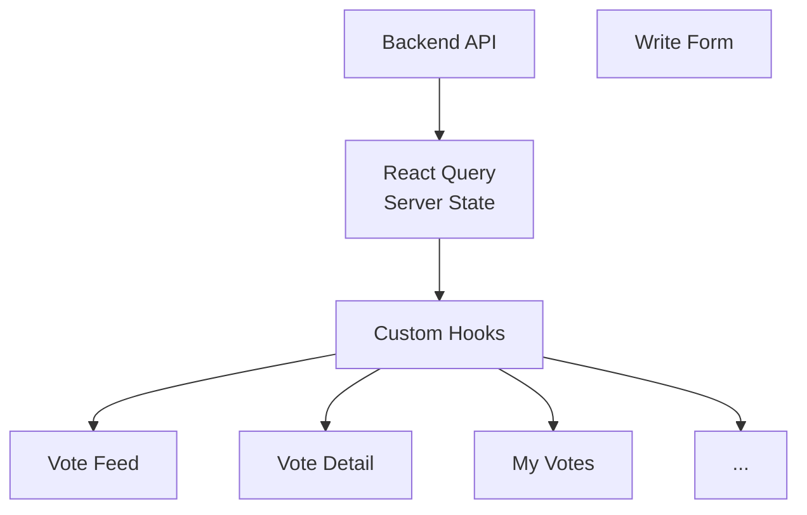
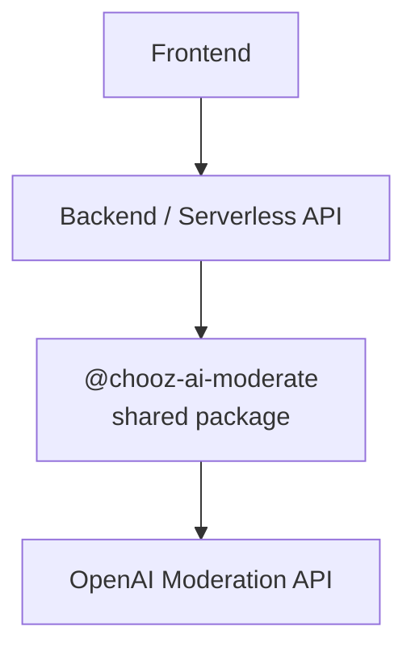
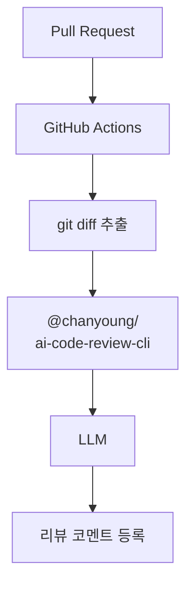

## 📑 목차

- [0. 프로젝트 소개](#0-프로젝트-소개)
  - [System Architecture](#system-architecture)

- [1. Problem & Solution](#1-problem--solution)
  - [1-1. 데이터 흐름 · 캐시 구조 정비](#1-1-데이터-흐름--캐시-구조-정비)
  - [1-2. 무한 스크롤 표준화 아키텍처](#1-2-무한-스크롤-표준화-아키텍처)
  - [1-3. AI Moderation 시스템 구축](#1-3-ai-moderation-시스템-구축)
  - [1-4. AI 기반 코드 리뷰 CI 구축](#1-4-ai-기반-코드-리뷰-ci-구축)
  - [1-5. CI 파이프라인 최적화](#1-5-ci-파이프라인-최적화)
  - [1-6. MSW 기반 독립 개발 환경 구축](#1-6-msw-기반-독립-개발-환경-구축)

- [2. Key Insight](#2-key-insight)
## 0. 프로젝트 소개

Chooz는 사용자의 주관적인 고민을 투표 데이터로 구조화해 더 빠르고 객관적인 선택을 돕는 의사결정 지원 서비스입니다.

이 프로젝트에서는 게시글·투표 기능 구현에 그치지 않고, 다음과 같은 구조적 문제를 해결하는 데 집중했습니다.

- 여러 화면에서 동일 데이터를 다루는 과정에서 발생한 캐시 일관성 문제
- 사용자 생성 콘텐츠 서비스의 사후 대응 중심 운영 구조
- 반복적인 리뷰/검사 작업으로 인한 개발 생산성 저하
- 백엔드 의존으로 인해 프론트엔드 개발이 대기하는 병목

---

## System Architecture
Chooz 프론트엔드는 서버 상태와 클라이언트 상태를 분리하는 구조를 기본 원칙으로 설계했습니다.

`REST API → React Query → Custom Hooks → UI`


---
## 1. Problem & Solution

Chooz에서 다룬 문제는 크게 여섯 가지였습니다.

1. 데이터 흐름 · 캐시 구조 정비
2. 무한 스크롤 표준화
3. AI Moderation 시스템 구축
4. AI 기반 코드 리뷰 CI 구축
5. CI 파이프라인 최적화
6. MSW 기반 독립 개발 환경 구축

---

## 1-1. 데이터 흐름 · 캐시 구조 정비

### 🚨 Problem

투표 피드, 투표 상세, 사용자 프로필, 내 작성글 등 여러 화면이 서로 연관된 데이터를 사용하고 있어 mutation 이후 어떤 캐시를 갱신해야 하는지 추적하기 어려웠습니다.

대표적으로 다음 문제가 발생했습니다.

- 상세 화면은 최신 상태인데 목록 화면은 이전 상태로 남는 문제
- 같은 데이터를 서로 다른 queryKey로 관리해 캐시가 분산되는 문제
- invalidate 범위를 정확히 잡지 못해 과도한 refetch 또는 누락이 발생하는 문제

같은 데이터를 어떤 기준으로 식별하고 관리할지 정리되지 않은 상태였습니다.

---
### Cause

초기에는 queryKey 규칙이 정리되어 있지 않았습니다.
```
'votes'
'voteDetail'
'votesList'
'userVoteList'
```
위와 같이 일관되지 않은 캐시 구조였습니다.

같은 엔티티를 서로 다른 key로 관리하면서 캐시 구조가 일관되지 않았고, mutation 이후 어떤 범위를 갱신해야 하는지 추론하기 어려웠습니다.

---
### ✅ Solution

`queryKey`를 도메인 기준으로 표준화했습니다.

```
['domain', identifier, options]
```
예시:
```
['votes']
['votes', voteId]
['votes', voteId, 'comments']
['userVotes', userId]
```

각 key가 표현하는 범위를 명확히 정리했습니다.

`['votes']` → 투표 목록 컬렉션

`['votes', voteId]` → 특정 투표 엔티티

`['votes', voteId, 'comments']` → 특정 투표의 하위 리소스

`['userVotes', userId]` → 특정 사용자의 투표 목록

또한 queryKey와 enabled를 분리해 데이터 식별과 실행 조건의 책임을 나눴습니다.

```js
useQuery({
  queryKey: ['votes', voteId],
  queryFn: fetchVoteDetail,
  enabled: Boolean(voteId),
});
```

mutation 이후에는 key 기준으로 영향 범위를 명확히 정의했습니다.

```js
queryClient.invalidateQueries(['votes'])
queryClient.invalidateQueries(['votes', voteId])
```

---

### Result

- 캐시 갱신 범위를 queryKey 기준으로 추적할 수 있게 됨
- 일부 화면만 stale 상태로 남는 문제를 구조적으로 줄임
- 서버 상태 식별 규칙이 정리되어 유지보수성이 높아짐
- 기능 추가 시 invalidate 대상을 추론하기 쉬워짐

---

## 1-2. 무한 스크롤 표준화 아키텍처
### 🚨 Problem

피드, 알림, 내 투표 목록 등 여러 리스트 화면에서 cursor 기반 페이지네이션이 필요했습니다.

데이터 적재 자체는 `useInfiniteQuery`로 처리할 수 있었지만, 다음 페이지 호출 시점을 감지하는 방식과 로딩 가드 로직이 화면마다 달라 재사용성이 떨어졌습니다.

- 어떤 화면은 scroll 이벤트 기반
- 어떤 화면은 하단 버튼 방식
- 어떤 화면은 로딩 중에도 추가 호출 가능
- 감지 로직과 페이징 호출 조건이 섞여 있어 공통화 어려움

`useInfiniteQuery`는 데이터 적재를 해결했지만, 다음 페이지를 호출하는 UI 트리거 패턴은 화면마다 달라 일관된 구조를 만들기 어려웠습니다.

---
### Cause

여러 리스트 화면에서 `useInfiniteQuery` 기반 페이지네이션은 사용할 수 있었지만, 다음 페이지를 불러오는 트리거 방식이 화면마다 제각각이었습니다.

기존에는 scroll 이벤트에서 현재 위치를 직접 계산한 뒤 조건을 검사해 `fetchNextPage()`를 호출하는 구조였습니다.

```
scroll event -> 현재 스크롤 위치 계산 -> 조건 검사 -> fetchNextPage()
```

이 방식은 화면마다 다음과 같은 로직을 반복하게 만들었습니다.

- 현재 스크롤 위치 계산
- 마지막 지점 도달 조건 정의
- 로딩 중 추가 호출 방지
- 다음 페이지 존재 여부 확인

데이터 요청 자체는 `React Query`가 처리하고 있었지만, 언제 요청할지를 결정하는 감지 로직이 UI마다 흩어져 있어 재사용과 유지보수가 어려운 상태였습니다.

---
### ✅ Solution

무한 스크롤을 감지 계층과 페이지 요청 계층으로 분리해 공통 패턴으로 표준화했습니다.

```
IntersectionObserver
      ↓
sentinel 감지
      ↓
guard 조건 확인
      ↓
fetchNextPage
      ↓
React Query pagination
```

스크롤 위치를 직접 계산하는 대신, 브라우저의 `IntersectionObserver`를 활용해 리스트 하단 sentinel 요소가 viewport에 진입했는지만 감지하도록 변경했습니다.

이후 감지 결과를 바로 fetch로 연결하지 않고, 공통 가드 조건을 통과할 때만 `fetchNextPage()`를 호출하도록 구성했습니다.

```js
export const InfiniteScroller = ({
  fetchNextPage,
  hasNextPage,
  isFetchingNextPage
}) => {

  const { ref } = useInView({
    onChange: (inView) => {
      if (inView && hasNextPage && !isFetchingNextPage) {
        fetchNextPage()
      }
    }
  })

  return <div ref={ref} />
}
```

공통 가드 조건도 함께 정리했습니다.

- `inView`: sentinel이 화면에 들어왔는지
- `hasNextPage`: 다음 페이지가 존재하는지
- `isFetchingNextPage`: 현재 추가 요청이 진행 중인지

위와 같은 구조로 `감지`는 공통 컴포넌트가 담당하고, `데이터 적재`는 각 화면의 `useInfiniteQuery`가 담당하는 방식으로 역할을 분리했습니다.

---
### Result

- 피드·알림·내 투표 목록 등 4개 리스트 화면에 동일한 무한 스크롤 패턴을 재사용
- 화면마다 구현되던 scroll 위치 계산 및 요청 가드 로직을 공통 훅으로 통합
- `inView / hasNextPage / isFetchingNextPage` 3중 가드 조건을 표준화해 중복 호출 방지 기준을 일관되게 유지
- 신규 리스트 화면 추가 시 무한 스크롤 로직을 다시 구현할 필요 없이 공통 패턴을 그대로 적용

---
## 1-3. AI Moderation 시스템 구축

### 🚨 Problem

기존에는 게시글 등록 이후 운영자가 부적절한 표현을 확인하고 삭제하는 사후 대응 방식으로 운영했습니다.

- 부적절한 콘텐츠가 저장 직후 서비스에 노출될 수 있었음
- 운영자가 직접 검수와 삭제를 반복해야 했음
- 콘텐츠가 늘어날수록 검수 비용과 대응 시간이 함께 증가했음
- 사용자는 작성 단계가 아니라 삭제 이후에야 문제를 인지했음

---

### Cause

기존 흐름은 저장 이후 검수에 의존하고 있었습니다.

```
User Input -> DB 저장 -> 운영자 확인 -> 삭제/제재
```

유해 데이터가 시스템 내부에 저장된 뒤 대응하는 구조였고, 운영 비용과 대응 속도가 모두 사람의 힘에 의존했습니다.

---

### ✅ Solution

OpenAI Moderation API를 활용해 작성 단계에서 유해 표현을 선제적으로 검사하는 구조를 도입했습니다.

Moderation 로직은 프론트 프로젝트 내부에 직접 두지 않고 별도 패키지와 서버 계층으로 분리했습니다.



구조를 분리한 이유는 3가지였습니다.

- OpenAI API Key를 프론트엔드에 두지 않기 위해 (보안)
- 유해 표현을 판별하는 로직과 UI 로직을 분리하기 위해
- 해당 도메인에 맞는 정책 로직을 한 곳에서 관리하고 재사용하기 위해

역할도 함께 분리했습니다.

- UI: 검사 요청, 결과 표시
- 패키지: 텍스트 판별 로직
- 서버 계층: 비밀키 관리, 호출 제어

---

### Result

- 유해 표현을 저장 이후가 아니라 작성 시점에 선제적으로 차단
- 운영자의 후처리 검수 부담을 줄일 수 있는 기반 마련
- 프론트·서버·정책 로직의 책임 분리 가능
- 정책 변경이나 모델 교체에 대응하기 쉬운 구조 확보

---

## 1-4. AI 기반 코드 리뷰 CI 구축
### 🚨 Problem

기존 코드 리뷰는 PR 생성 이후 리뷰어가 diff 전체를 직접 확인하며 1차 검토부터 모두 수동으로 수행하는 구조였습니다.

리뷰 초반의 반복 작업에 시간이 먼저 소모되었고, 리뷰어가 설계와 도메인 판단에 집중하기 어려웠습니다.

---
### Cause

기존 PR 리뷰 프로세스는 아래와 같았습니다.

`PR 생성 -> 사람이 diff 전체 읽기 -> 반복 패턴 점검 -> 코멘트 작성`

사이드 프로젝트와 같은 소규모 팀에서는 리뷰어 수가 많지 않아 반복적인 1차 리뷰 비용이 그대로 생산성 저하로 이어졌습니다.

---

### ✅ Solution

PR 생성 시 diff를 추출해 AI가 1차 리뷰 코멘트를 생성하는 CI 파이프라인을 구축했습니다.


AI가 리뷰를 대체하는 것이 아니라, 1차 탐색 비용을 줄이고 사람이 더 중요한 판단에 집중할 수 있도록 하였습니다.

---

### Result

- 반복적이고 기계적인 1차 리뷰 작업을 자동화할 수 있는 기반 확보
- 리뷰어가 설계, 도메인 로직, 사용자 영향 같은 고차원 판단에 더 집중할 수 있게 됨
- 리뷰 프로세스를 `AI 1차 스크리닝 + 사람 최종 판단` 구조로 개선함

---
## 1-5. CI 파이프라인 최적화
### 🚨 Problem

프로젝트가 커질수록 CI에서 린트와 검증 시간이 길어졌고, PR마다 피드백 루프가 느려졌습니다.

---
### Cause

원인을 분석한 결과 변경 여부와 관계없이 전체 린트를 매번 다시 수행하고 있었습니다.

---
### ✅ Solution

ESLint cache 전략을 도입해 이전 실행 결과를 재사용하도록 CI 구조를 개선했습니다.

`yarn lint --cache`

변경되지 않은 파일은 이전 결과를 재사용하고, 실제로 다시 검사해야 하는 파일에만 비용을 집중하도록 구성했습니다.

---
### Result

- 변경 파일 기준으로 린트 범위를 제한해 불필요한 검사 제거
- 전체 실행 대비 CI 빌드 시간 88% 단축

---

## 1-6. MSW 기반 독립 개발 환경 구축
### 🚨 Problem

백엔드 API 구현 전까지 프론트엔드 개발이 대기해야 했습니다.

- API 준비 전까지 화면 구현 지연
- 임시 dummy 데이터가 컴포넌트 내부에 흩어져 적재됨
- 실제 네트워크 흐름과 다른 방식으로 개발하게 될 가능성 존재
- 백엔드 연동 시점에 재수정 비용 발생

---
### Cause

프론트엔드가 서버 준비 이후에야 정상적으로 동작하는 구조였습니다.

데이터 요청, 로딩 상태, 에러 처리, pagination 같은 실제 사용자 흐름을 백엔드 준비 전에는 검증할 수 없었습니다.

---
### ✅ Solution

MSW를 적용해 네트워크 레벨에서 API를 모킹하는 독립 개발 환경을 구축했습니다.

```js
rest.get('/api/votes', (req, res, ctx) => {
  return res(
    ctx.status(200),
    ctx.json(mockVotes)
  )
})
```
컴포넌트 내부에 임시 더미 데이터를 넣는 대신, 실제 요청 흐름을 가로채는 방식으로 개발 환경을 구성했습니다.

---

### Result

- 프론트엔드 독립 개발 가능
- 백엔드와 병렬 개발 가능
- 실제 요청 흐름에 가까운 방식으로 UI와 상태 처리 검증 가능
- 개발 기간 단축

---

## 2. Key Insight

### 프로젝트를 통해 얻은 핵심 세 가지

1. 프론트엔드에서도 데이터 식별 체계 설계가 중요하다

React Query를 도입했다고 캐시 문제가 자동으로 해결되지는 않았습니다.
queryKey를 어떻게 설계하느냐가 곧 데이터 흐름의 품질과 유지보수성을 결정할 수 있음을 깨달았습니다.

2. 사용자 생성 콘텐츠의 품질은 기능보다 운영 구조에서 갈릴 수 있다.

사용자 테스트를 진행하면서 고려해야할 부분은 게시글 작성 기능을 넘어 유해 콘텐츠를 언제, 어디서, 어떤 비용으로 통제할 것이었습니다.
Moderation은 기능 추가가 아니라 운영 구조 설계에 가까운 문제로 판단하였습니다.

3. 좋은 자동화는 사람을 대체하는 것이 아니라 판단 비용을 줄인다.

AI 리뷰, CI 캐시, MSW는 모두 반복 작업을 줄이고 사람이 더 중요한 문제를 바라보고, 결과적으로 구조적인 문제에 좀 더 고민할 수 있도록 하는 장치였습니다.
